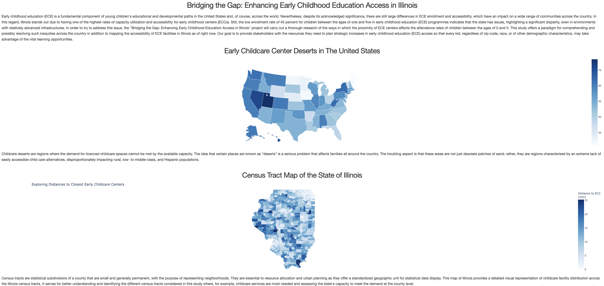
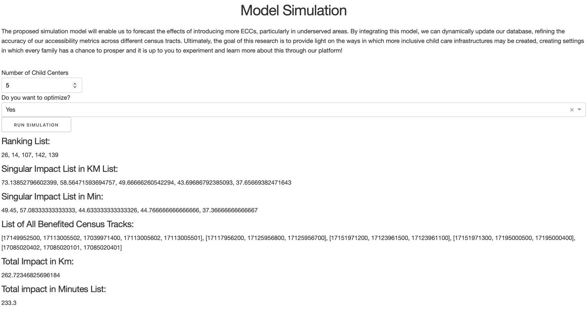

# <center> <span style="color:maroon;"> Early Education Project</span></center>

### <center> a CAPP 30122 Final Project by

[Elena Porfidia](https://github.com/elenaporfidia)  
[Joaquin Pinto](https://github.com/joaqpinto)  
[Miguel Perez](https://github.com/miguelperez94)  
[Rodrigo Rivarola](https://github.com/rjrivarola)</center>

### <span style="color:maroon;"> About our Project </span>

The goal of this project is to analyze the importance of the distance to the closest childcare centers and its relationship with attendance rates of early childhood education (0-5 y/o) in Illinois on a Census Tract level. The motivation for the project and the focus on early childhood is that Illinois only has 45% of its three to four year old population attending early childhood education (America’s Health Rankings, 2021).

We started by using the Census API to retreive socioeconomic data on the tract level in Illinois. We retreived the total population, population of children aged under 5, racial breakdown of each tract, poverty status, median income, home ownership and education rates, among others.

The next step was to clean this data, converting the variables into proportions of the populations, creating identifiers for some variables, and removing outliers, such as tracts with unidentified median incomes or 0 children reported.

We also downloaded a shapefile for all the Census Tracts in Illinois, as well as data for the locations and capacities of all Early Education Centers in Illinois from the Homeland Infrastructure Foundation-Level Data (HIFLD).

The next step was to calculate the distances to the three closest centers for each Census Tract. This was completed by using the Google Distance Matrix API. We started by using a haversine distance calculator to dwindle down the list of nearest Early Education Centers before calculating the time and distance. We used an increasing radius until each tract was matched to at least 3 centers, which would allow us to rank them by distance and driving time.

We followed this up by merging the data, allowing us to discover how various socioeconomic factors might be correlated with the distance to nearest Early Education Center. This information can be seen in our Data Visualization board, that was created using Dash.



Lastly, we created a function that would optimize the location of a predetermined number of Early Education Centers in Illinois, reducing the total time traveled accross all Tracts. The idea behind this is imagining a situation where the state was given enough of a budget to build a specific number of Early Education Centers, hoping to increase accesibility by reducing the time required to travel to the centers, assuming that a large factor in accesibility is the travel time*. If you were to just place the Early Education Center inside the Tracts with the longest time to the nearest centers you may not be fulfilling this goals as effectively as possible, as there may be multiple Tracts near enough to each other that would benefit greater from a more centralized placement. This model can be tested in the last section of our Data Visualization board.



### <span style="color:maroon;"> How to Run our Model </span>
Our Scripts are all saved within the analysis folder in our Early Education Repository. Once the repository is cloned, this can be run from your Terminal, with a few requirements beforehand.

Firstly, you must run `poetry install` to ensure you have the right packages.

Next, you must apply for the Census and Google Matrix Distance API keys, and place them in the CensusAPI_key.txt and Google_distance_API_key.txt files provided. The process for doing so is fairly straightforward:

- Census API - https://api.census.gov/data/key_signup.html
- Google API - https://developers.google.com/maps/documentation/distance-matrix/overview?hl=es-419

Lastly, running `poetry run analysis` from the parent directory will retreive all the data and automatically open a browser with the Data Visualization dashboard. 

There are a few options you can add afterwards, however those are mostly to ensure you do not overwrite the data we have already retreived and cleaned then placed in the correct data folder.
```
# Runs Google Distance API, there is a cost associated with this
--googleapi default=False 

# Runs data clean and gather, some of these take a while to run
--gather_data default=True 

# Places the data clean and gather outputs in a separate test folder, to avoid rewriting what we already have
--test default=True 
```

* Disclaimer: We recognize that the placing decision for new childcare centers is a multifactorial decision rather than a decision that is only defined by the distance to the closest childcare center. In this context, the results of the optimization must be taken carefully and only as a reference of where new childcare centers would have the highest impact on census tracts in Illinois in terms of distance, not as a final decision or suggestion related to the best location for new childcare centers.
